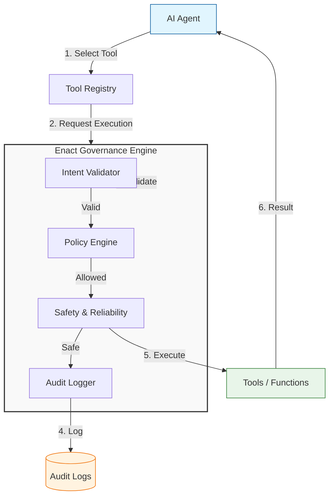

# Enact Integration Master Guide

This guide explains how to integrate Enact into your AI Agent framework. It covers the complete flow from tool registration to runtime governance.

## Architecture Overview

Enact acts as a **middleware** between your Agent's intent and the actual Tool Execution.



---

## 1. Setup & Registration

First, define your tools and register them. Enact supports both local Python functions and abstract tools.

```python
from enact import InMemoryToolRegistry, ToolRegistration
from datetime import datetime, timedelta

# Initialize Registry
registry = InMemoryToolRegistry()

# --- A. Register Local Tools ---
def query_database(sql: str):
    return "Result"

registry.register_tool(
    name="database",
    tool=query_database,
    allowed_agents=["support-bot"],
    expires_at=datetime.now() + timedelta(days=365) # Optional
)

# --- B. Register MCP Tools (Conceptual) ---
# If you are using an MCP Client, you register the client's call method
# wrapper as the tool.
class MCPToolWrapper:
    def __init__(self, client, tool_name):
        self.client = client
        self.tool_name = tool_name
    
    def __call__(self, **kwargs):
        return self.client.call_tool(self.tool_name, kwargs)

# Register the wrapper
# registry.register_tool("mcp_weather", MCPToolWrapper(client, "weather"))
```

## 2. Configure Governance

Set up the rules, validators, and safety checks.

```python
from enact import (
    GovernanceEngine, 
    RuleBasedPolicy, Rule,
    JustificationValidator,
    RateLimiter, QuotaManager,
    JsonLineAuditor
)

# 1. Define Policy
policy = RuleBasedPolicy(rules=[
    Rule("allow_db", "allow", "tool == 'database'"),
    Rule("deny_admin", "deny", "tool == 'admin'")
])

# 2. Setup Validators (Pre-Execution Checks)
validator = JustificationValidator(min_length=10)

# 3. Setup Safety Config
safety_settings = {
    "rate_limiter": RateLimiter(max_requests=10, window_seconds=60),
    "quota_manager": QuotaManager(...)
}

# 4. Initialize Engine
engine = GovernanceEngine(
    policy=policy,
    validator=validator,
    auditors=[JsonLineAuditor("audit.log")],
    **safety_settings
)
```

## 3. The Agent Loop (Integration)

This is how you instrument your agent loop to use Enact.

```python
from enact import GovernanceRequest, ToolIntent

class Agent:
    def __init__(self, registry, engine):
        self.registry = registry
        self.engine = engine
        self.agent_id = "agent-1"

    def run(self, prompt):
        # 1. LLM decides to call a tool (Conceptual)
        # llm_response = llm.generate(prompt)
        # tool_call = parse(llm_response)
        
        # Example Decision:
        tool_name = "database"
        args = {"sql": "SELECT * FROM users"}
        justification = "I need to fetch user data to answer the query."
        
        # 2. Create Governance Request
        request = GovernanceRequest(
            agent_id=self.agent_id,
            tool_name=tool_name,
            function_name="query_database", # or same as tool_name
            arguments=args,
            context={
                "justification": justification,
                "confidence": 0.95
            }
        )
        
        # 3. Evaluate via Enact
        decision = self.engine.evaluate(request)
        
        if not decision.allow:
            print(f"🛑 Blocked: {decision.reason}")
            return "I cannot perform this action due to safety policy."
            
        # 4. Execute (if allowed)
        try:
            # Retrieve the callable from registry
            func = self.registry.get_tool(tool_name, self.agent_id)
            if not func:
                return "Tool not found or access denied."
                
            result = func(**args)
            print(f"✅ Executed: {result}")
            return result
            
        except Exception as e:
            # Enact's safety features (CircuitBreaker) might raise errors here 
            # if you wrapped the tool execution.
            print(f"⚠️ Execution Error: {e}")
```

## 4. Advanced: Using Wrappers

For tighter integration, you can use Enact's wrappers to automatically handle the governance check during the function call.

```python
from enact import govern

# Decorate a function to be governed automatically
@govern(engine, agent_id="agent-1")
def risky_action(param):
    print(f"Doing {param}")

# Calling this will trigger the engine.evaluate() internally
# risky_action("something")
```
