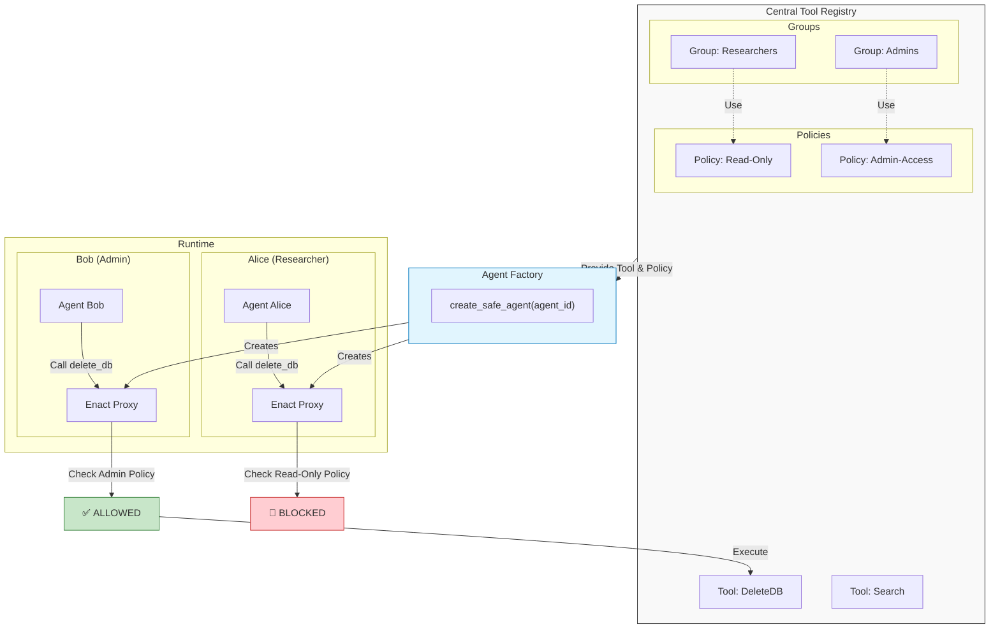

# Multi-Agent Governance Architecture

This document explains the architecture implemented in `examples/05_multi_agent_registry.py`.

## Conceptual Flow

The system uses a **Central Registry** to define permissions, but enforces them via **Distributed Proxies** wrapped around tools injected into agents.



## Key Components

1.  **Registry**: The single source of truth. It knows that "Alice" belongs to "Researchers" and that "Researchers" use the `ReadOnlyPolicy`.
2.  **Factory**: The code that bridges configuration and runtime. It fetches the *specific* policy for Alice regarding `delete_db` and instantiates a `GovernanceEngine` just for that tool.
3.  **Proxies**: The `ExternalAgent` (Alice) doesn't hold the real `delete_db` function. It holds an `Enact` wrapper. When Alice tries to call it, the wrapper runs the policy check locally.

---

# Rule & Policy Reference

This section details how to define explicit Rules for use in a `RuleBasedPolicy`.

## The `Rule` Object

A `Rule` defines a pattern to match against a tool execution request.

### Fields
*   **tool** (`str`): Regex pattern to match the tool name (e.g., `delete_file`, `db_.*`).
*   **function** (`str`): Regex pattern to match the function name (e.g., `execute_.*`, `*`).
*   **agent_id** (`str`): Regex pattern to match the agent ID calling the tool (e.g., `admin`, `user_.*`, `*`). *Default: `*`*.
*   **action** (`str`): `"allow"` or `"deny"`.
*   **reason** (`str`): Human-readable explanation for the audit log.

## Defining Policies

### 1. In Python (Programmatic)

Use this for dynamic policies or when defining rules alongside code.

```python
from enact import RuleBasedPolicy, Rule

policy = RuleBasedPolicy(rules=[
    # Allow specific tool for specific agent
    Rule(
        tool="database_tool",
        function="delete_table",
        agent_id="admin_bob",  # Only Bob can do this
        action="allow",
        reason="Bob is the DBO"
    ),
    # Allow read-only for everyone else
    Rule(
        tool="database_tool",
        function="read_.*",
        action="allow",  # agent_id defaults to "*"
        reason="Public Read Access"
    ),
    # Deny everything else (Best Practice)
    Rule(
        tool=".*",
        function=".*",
        action="deny",
        reason="Default Deny"
    )
])
```

### 2. In YAML (Configuration)

Use this for externalizing policy from code, easier for non-devs to review. Load with `PolicyLoader.load("policy.yaml")`.

```yaml
default_allow: false
rules:
  - tool: "database_tool"
    function: "delete_table"
    agent_id: "admin_bob"
    action: "allow"
    reason: "Bob is the DBO"

  - tool: "database_tool"
    function: "read_.*"
    action: "allow"
    reason: "Public Read Access"

  - tool: ".*"
    function: ".*"
    action: "deny"
    reason: "Default Deny"
```

### 3. In JSON (API/Web)

Use this for receiving policies from APIs or frontends. Load with `PolicyLoader.load("policy.json")`.

```json
{
  "default_allow": false,
  "rules": [
    {
      "tool": "database_tool",
      "function": "delete_table",
      "agent_id": "admin_bob",
      "action": "allow",
      "reason": "Bob is the DBO"
    },
    {
      "tool": "database_tool",
      "function": "read_.*",
      "action": "allow",
      "reason": "Public Read Access"
    },
    {
      "tool": ".*",
      "function": ".*",
      "action": "deny",
      "reason": "Default Deny"
    }
  ]
}
```
